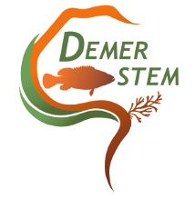

# GPSMonitoring

This package was initially developped during DEMERSTEM EU project. It aims to developp tools for an easier use of GPS data for fisheries monitoring. 

## DEMERSTEM project

An in-depth paragraph about your project and overview of use.

## Getting Started

### Dependencies


### Installing

```
devtools::install_github('polehalieutique/GPSMonitoring')
```

### Executing program


## Help


## Authors

Jerome Guitton, 

UMR DECOD (Dynamique et Durabilité des Ecosystèmes), Institut Agro, IFREMER, INRAE Rennes, France

65, rue de Saint-Brieuc CS 84215
35042 Rennes Cedex France


[@jeromeguitton1](https://twitter.com/jeromeguitton1)

## Version History

* 0.1.0
    * Initial Release

## License

This project is licensed under the GNU GPL License - see the LICENSE.md file for details

## Acknowledgments

Marie Pierre Etienne
Marc Leopold
Mohamed Soumah
Nicolas Bez


